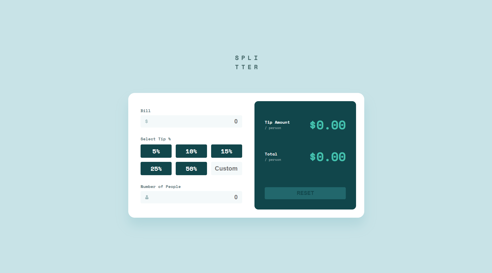
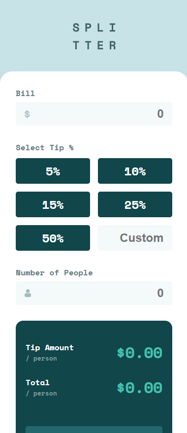

# Splitter - Tip Calculator

  
  
  
  
  

   
   

  
  
  

---

## About The Project

This is a fully functional, responsive **Tip Calculator** application. The project focuses on DOM manipulation, form validation, and providing a clean, modern user interface. It is built with a **mobile-first** approach, ensuring the layout transitions smoothly from a single-column view on mobile devices to a polished, side-by-side card layout on larger screens.

It demonstrates the use of semantic HTML5, CSS custom properties (variables) for maintainable theming, and Vanilla JavaScript for handling user inputs and mathematical calculations in real-time.

### Key Features

- **Real-Time Calculations:** The app instantly calculates the tip amount per person and the total bill per person as the user types.
- **Custom Error Handling:** Includes logic to prevent division by zero, preventing the app from displaying `NaN` or `Infinity` errors.
- **Mobile-First Workflow:** Styles are written for mobile screens first, then expanded for desktop using a `min-width: 1440px` media query.
- **Accessible Inputs:** Custom tip selection relies on hidden radio buttons linked to labels, ensuring semantic correctness and better accessibility while maintaining the design.
- **Interactive UI States:** Features dynamic hover, focus, and disabled states for buttons and inputs, providing clear visual feedback to the user.

---

## Screenshots

 
  <h3>Desktop View</h3>
  

 

  

    <h3>Mobile View</h3>
    
  

---

## Built With

- **[HTML5](https://developer.mozilla.org/en-US/docs/Web/HTML)** - Semantic structure and form elements.
- **[SCSS / SASS](https://sass-lang.com/)** - Utilized nesting syntax and variables for cleaner, more organized stylesheets.
- **[CSS Flexbox & Grid](https://developer.mozilla.org/en-US/docs/Web/CSS/CSS_Grid_Layout)** - Used for the main component alignment, the side-by-side desktop layout, and the tip percentage button grid.
- **[Vanilla JavaScript](https://developer.mozilla.org/en-US/docs/Web/JavaScript)** - Used for DOM element selection, event listeners, state management, and math logic.
- **[Google Fonts](https://fonts.google.com/)** - Integration of the "Space Mono" font for a distinct, calculator-like typography.
